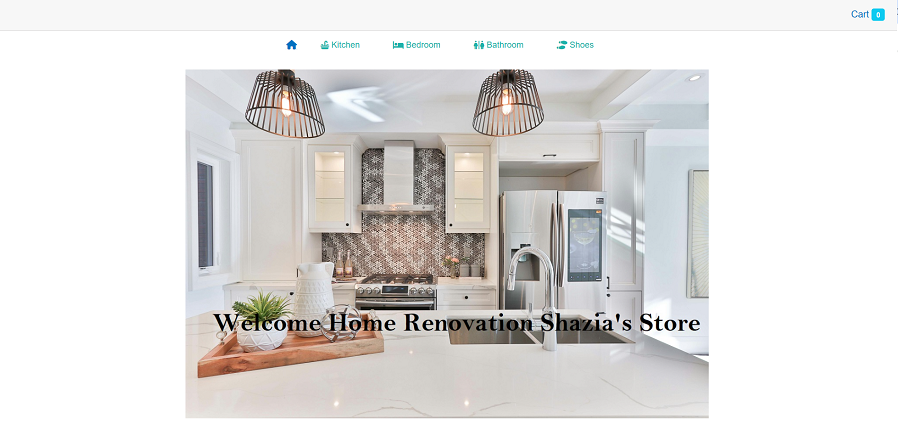
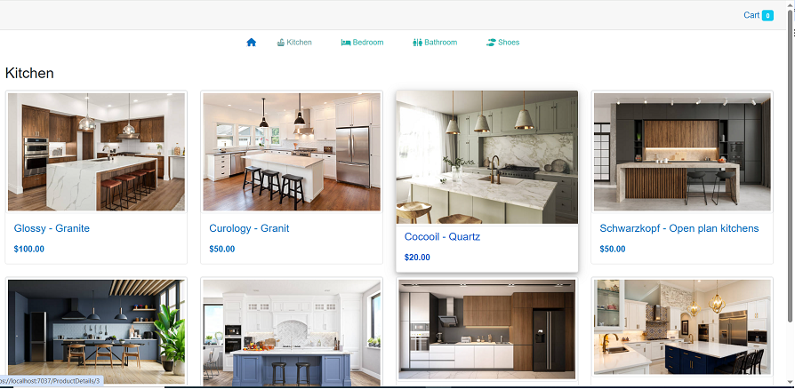
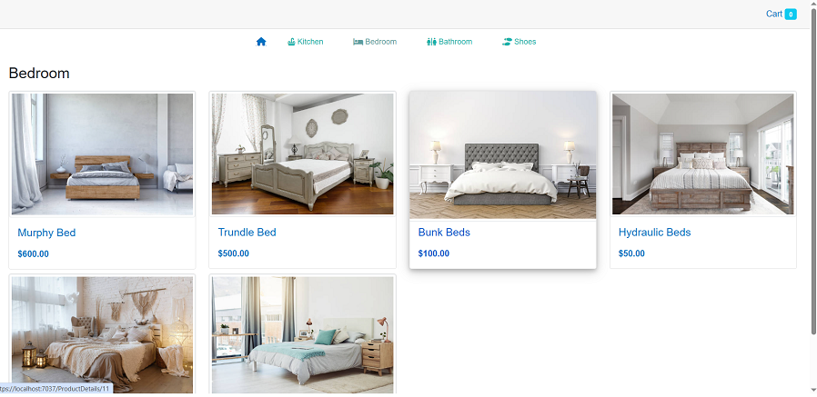
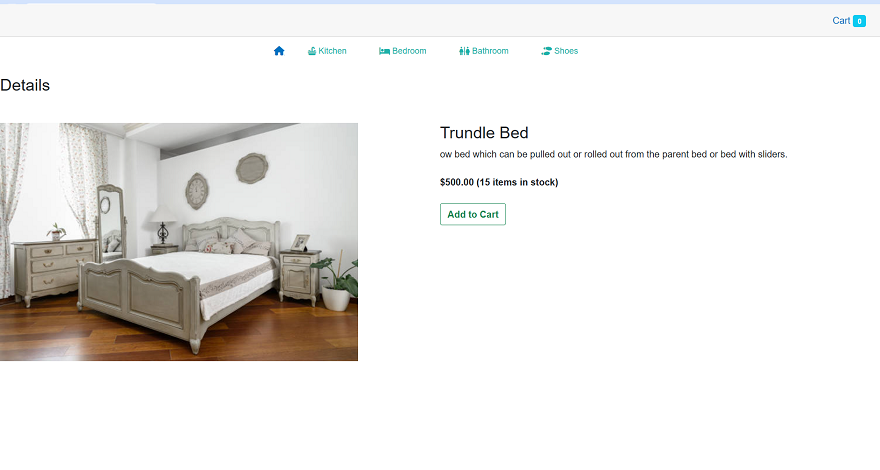
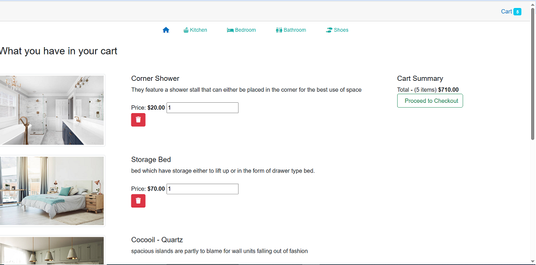

# Home Improvement Shopping Cart Blazor 🛠️

A comprehensive Blazor WebAssembly + ASP.NET Core Minimal API project for managing a home improvement shopping cart best practices.

## 🚀 Features
- Product listing with images
- Shopping cart with local storage
- Minimal API backend with EF Core
- Responsive UI with Bootstrap

## 🛠️ Tech Stack
- [Blazor WebAssembly](https://dotnet.microsoft.com/apps/aspnet/web-apps/blazor)
- [.NET 9 Minimal API](https://learn.microsoft.com/aspnet/core/fundamentals/minimal-apis)
- [Entity Framework Core 9](https://learn.microsoft.com/ef/core)
- [SQL Server](https://www.microsoft.com/sql-server)
- [Blazored.LocalStorage](https://github.com/Blazored/LocalStorage)

### Screetshots

## ⚡ Getting Started

### Prerequisites
- .NET 9 SDK
- Visual Studio 2022 / VS Code
- SQL Server

### Clone the repo
git clone https://github.com/Shazia72/HomeImprovementShopCartBlazor.git
cd HomeImprovementShopCartBlazor

### Run the API
cd HomeImprovementShopCartBlazor.API
dotnet ef database update
dotnet run

### Run the Client
cd HomeImprovementShopCartBlazor.Web
dotnet run

